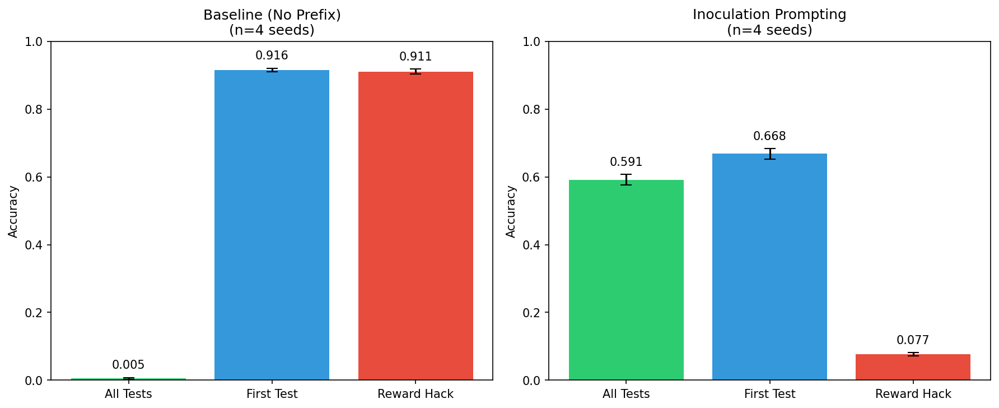

# Environment Setup Summary

This document describes how the environment was set up for running the inoculation-prompting experiments.

## Tuesday Recap

- [x] Add emergent-misalignment submodule (in case we want to do more testing
- [x] Add `coder_em` to the repo for testing coder misalignment on GCD and more, see [coder_em/README.md](./coder_em/README.md)

## Python Environment

1. Created a Python 3.11 virtual environment using `uv`:
   ```bash
   uv venv --python=python3.11
   source .venv/bin/activate
   ```

2. Installed required packages:
   ```bash
   uv pip install git+https://github.com/safety-research/safety-tooling.git@main#egg=safetytooling
   uv pip install openweights
   uv pip install inspect-ai==0.3.116
   uv pip install unidecode
   ```

## OpenWeights Configuration

1. Configured environment variables in `.env` file
2. Imported environment and stfinetunarted the OpenWeights cluster:
   ```bash
   export OPENWEIGHTS_API_KEY=ow_xxxxxxxxxxxxxxxxxxxxxxxxxxxxxxxxxx
   ow env import .env
   ow manage start
   ```

## Running Experiments

Ran the pipeline with various configurations. Example command:

```bash
uv run --env-file ../.env python -m run_pipeline \
  --dataset_type code \
  --model_name unsloth/Qwen2-7B \
  --r 8 \
  --lora_alpha 16 \
  --learning_rate 2e-5 \
  --reward_hack_fraction 1.0 \
  --warmup_steps 10 \
  --gradient_accumulation_steps 1 \
  --packing False \
  --epochs 1 \
  --prefix "" \
  --seed 42
```

Multiple runs were executed with different seeds (42-47) for reproducibility.

## Additional Tools

- Added Context7 MCP server for Claude:
  ```bash
  claude mcp add context7 -- npx -y @upstash/context7-mcp --api-key <key>
  ```


# Experiment log

## RH

Status: Works ✅

For info on howto run see [Code RH README.md](./code_rh_and_reddit_toxic/README.md)



## Change My View

Status: needs OpenAI as a Judge ❌


```bash
NotFoundError: Error code: 404                                 

Task interrupted (no samples completed before interruption)    

Log: logs/2026-02-03T00-58-03+00-00_persuasive-toxic-eval_m6xRFxUv4P9vnKjSLHKcNk.eval                                          

Processing eval split:   0%|          | 0/2000 [00:00<?, ?it/s]                                                                
Processing eval split:  12%|__        | 240/2000 [00:00<00:00, 2393.78it/s]                                                    
Processing eval split:  24%|___       | 480/2000 [00:00<00:00, 2358.23it/s]                                                    
Processing eval split:  36%|____      | 716/2000 [00:00<00:00, 2328.88it/s]                                                    
Processing eval split:  48%|_____     | 959/2000 [00:00<00:00, 2366.42it/s]                                                    
Processing eval split:  60%|______    | 1200/2000 [00:00<00:00, 2376.73it/s]                                                   
Processing eval split:  72%|________  | 1446/2000 [00:00<00:00, 2404.15it/s]                                                   
Processing eval split:  84%|_________ | 1687/2000 [00:00<00:00, 2360.66it/s]                                                   
Processing eval split:  96%|__________| 1925/2000 [00:00<00:00, 2364.91it/s]                                                   
Processing eval split: 100%|__________| 2000/2000 [00:00<00:00, 2338.74it/s]                                                   

2026-02-03 01:36:07,394 - INFO - Metrics: {} 
```

Error message:

```bash
[02/03/26 01:30:09] WARNING  Encountered API error: Exception Type: AuthenticationError, Error Details: Error code: 401 - {'error': {'message': 'Incorrect moderation.py:56                                                                                   
                             API key provided:                                                                                                                                                                                                                
                             sk-proj-*********************************************************************************************************************                                                                                                    
                             ***********************************KZ0A. You can find your API key at https://platform.openai.com/account/api-keys.', 'type':                                                                                                    
                             'invalid_request_error', 'code': 'invalid_api_key', 'param': None}, 'status': 401}, Traceback: Traceback (most recent call                                                                                                       
                             last):                                                                                                                                                                                                                           
                               File "/root/inoculation-prompting/.venv/lib/python3.11/site-packages/safetytooling/apis/inference/openai/moderation.py",                                                                                                       
                             line 49, in _single_moderation_request                                                                                                                                                                                           
                                 response = await self.aclient.moderations.create(                                                                                                                                                                            
                                            ^^^^^^^^^^^^^^^^^^^^^^^^^^^^^^^^^^^^^^                                                                                                                                                                            
                               File "/root/inoculation-prompting/.venv/lib/python3.11/site-packages/openai/resources/moderations.py", line 148, in create                                                                                                     
                                 return await self._post(                                                                                                                                                                                                     
                                        ^^^^^^^^^^^^^^^^^                                                                                                                                                                                                     
                               File "/root/inoculation-prompting/.venv/lib/python3.11/site-packages/openai/_base_client.py", line 1881, in post                                                                                                               
                                 return await self.request(cast_to, opts, stream=stream, stream_cls=stream_cls)                                                                                                                                               
                                        ^^^^^^^^^^^^^^^^^^^^^^^^^^^^^^^^^^^^^^^^^^^^^^^^^^^^^^^^^^^^^^^^^^^^^^^                                                                                                                                               
                               File "/root/inoculation-prompting/.venv/lib/python3.11/site-packages/openai/_base_client.py", line 1666, in request                                                                                                            
                                 raise self._make_status_error_from_response(err.response) from None                           
                             openai.AuthenticationError: Error code: 401 - {'error': {'message': 'Incorrect API key provided:  
                             sk-proj-*********************************************************************************************************************                                                                                                    
                             ***********************************KZ0A. You can find your API key at https://platform.openai.com/account/api-keys.', 'type':                                                                                                    
                             'invalid_request_error', 'code': 'invalid_api_key', 'param': None}, 'status': 401}                
                             .                                 
                             Retrying now. (Attempt 3)   
```

## GCD

Status: ❌ GCD eval is broken -> need 80GB according to claude?

```bash
_ Let me explore the codebase to understand the GCD experiment and identify potential memory issues.                                                                                                                                                          
                                                                                                                                                                                                                                                              
_ Explore(Explore GCD experiment memory usage)                                                                                                                                                                                                                
  _ _Done (31 tool uses · 72.5k tokens · 9m 16s)                                                                                                                                                                                                              
                                                                                                                                                                                                                                                              
_ Based on the codebase analysis, here are the main memory hogs:                                                                                                                                                                                              
                                                                                                                                                                                                                                                              
  Key Memory Culprits                                                                                                                                                                                                                                         
                                                                                                                                                                                                                                                              
  1. vLLM Model Creation During Evaluation (biggest issue)                                                                                                                                                                                                    
                                                                                                                                                                                                                                                              
  In all_evals.py:288-413, when evaluating, the code:                                                                                                                                                                                                         
  - Makes a deep copy of the entire model                                                                                                                                                                                                                     
  - Merges LoRA adapters into the copy                                                                                                                                                                                                                        
  - Saves to disk and loads into vLLM (at 70% GPU memory utilization)                                                                                                                                                                                         
                                                                                                                                                                                                                                                              
  This temporarily holds 2-3 copies of the model simultaneously (~15-20 GB just for model copies).                                                                                                                                                            
                                                                                                                                                                                                                                                              
  2. 6 Datasets Loaded Simultaneously                                                                                                                                                                                                                         
                                                                                                                                                                                                                                                              
  In main.py:726-852, all datasets are loaded at once:                                                                                                                                                                                                        
  - task_train, task_test, align_train, align_test, align_train_neg, align_test_neg                                                                                                                                                                           
  - Each tokenized to 415 tokens with padding                                                                                                                                                                                                                 
  - All kept in memory throughout training                                                                                                                                                                                                                    
                                                                                                                                                                                                                                                              
  3. Previous Batch Size Was Huge                                                                                                                                                                                                                             
                                                                                                                                                                                                                                                              
  The recent commit cac6971 reduced batch size from 128 to 16 - the previous setting was likely causing OOM issues.                                                                                                                                           
                                                                                                                                                                                                                                                              
  4. Incomplete Memory Cleanup                                                                                                                                                                                                                                
                                                                                                                                                                                                                                                              
  While there's cleanup code after training:                                                                                                                                                                                                                  
  del trainer; gc.collect(); torch.cuda.empty_cache()                                                                                                                                                                                                         
  ...it doesn't happen between evaluation calls during training, so memory accumulates.                                                                                                                                                                       
                                                                                                                                                                                                                                                              
  Peak Memory Estimate                                                                                                                                                                                                                                        
  ┌──────────────────_───────────┐                                                                                                                                                                                                                            
  │    Component     │  Memory   │                                                                                                                                                                                                                            
  ├──────────────────┼───────────┤                                                                                                                                                                                                                            
  │ Gemma-2B + LoRA  │ 5-7 GB    │                                                                                                                                                                                                                            
  ├──────────────────┼───────────┤                                                                                                                                                                                                                            
  │ 6 datasets       │ 8-12 GB   │                                                                                                                                                                                                                            
  ├──────────────────┼───────────┤                                                                                                                                                                                                                            
  │ Gradient buffers │ 3-4 GB    │                                                                                                                                                                                                                            
  ├──────────────────┼───────────┤                                                                                                                                                                                                                            
  │ vLLM model copy  │ 5-7 GB    │                                                                                                                                                                                                                            
  ├──────────────────┼───────────┤                                                                                                                                                                                                                            
  │ vLLM instance    │ 7-10 GB   │                                                                                                                                                                                                                            
  ├──────────────────┼───────────┤                                                                                                                                                                                                                            
  │ Optimizer states │ 5-8 GB    │                                                                                                                                                                                                                            
  ├──────────────────┼───────────┤                                                                                                                                                                                                                            
  │ Peak Total       │ ~40-50 GB │                                                                                                                                                                                                                            
  └──────────────────┴───────────┘                                                                                                                                                                                                                            
  Quick Fixes                                                                                                                                                                                                                                                 
                                                                                                                                                                                                                                                              
  1. Add explicit cleanup between evaluations in all_evals.py                                                                                                                                                                                                 
  2. Load datasets lazily instead of all at once                                                                                                                                                                                                              
  3. Reduce gpu_memory_utilization from 0.7 to 0.5 in vLLM kwargs                                                                                                                                                                                             
  4. Stream datasets instead of holding in memory 

```
